# Tutor-app API

RESTful API built with Node.js, Express.js, Mongoose, Bcrypt and JWT. It uses 'jsonwebtoken' to create the token which was used to protect routes. [API](https://tutoronlineapp.herokuapp.com/).

## Quick Start

```bash
# Install dependencies
npm install

# Serve on localhost:3000
npm run start

or   

npm run dev-start
```
```
ADMIN======>
email:sirgreg@gmail.com
password:sirgreg
```

## API Endpoints and examples

### Category Routes

#### GET get categories

API endpoint to fetch all category in the category collection.

    GET /v1/category

* A successful API request will return HTTP 200 status with a list of categories.

* Request done an empty category collection will return an empty array.

#### Example Response
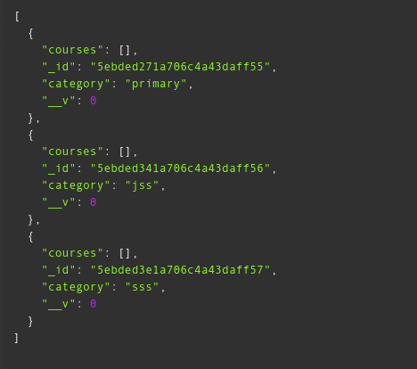

#### POST create category 

API endpoint to create category in the category collection.

    POST /v1/category/create (PROTECTED)

* A successful API request will return HTTP 201 status. Only an admin can perform this request.

```
{
	"category": "nursery"
}
```

#### Example Response
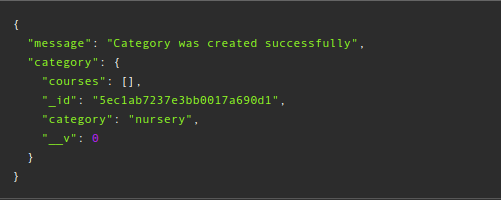

#### GET get course by category

API endpoint to fetch all courses by category in the category collection.

    GET /v1/category/:id/courses

* A successful API request will return HTTP 200 status with a list of courses in a category.

#### Example Response
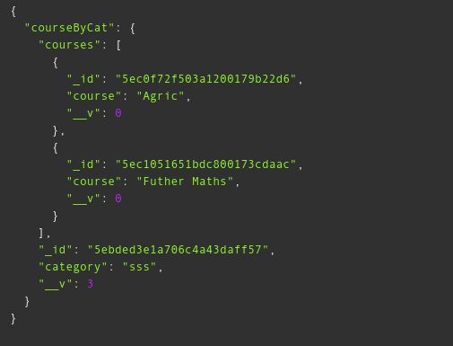

### Users Routes

#### GET get users

API endpoint to fetch all users in the user collection.

    GET /v1/users

* A successful API request will return HTTP 200 status with a list of users.

#### Example Response
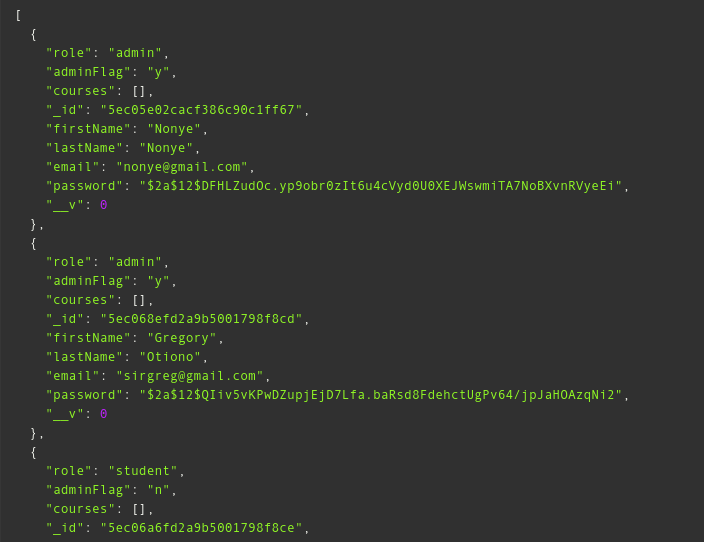

#### POST login user

API endpoint for log in in the user collection.

    POST /v1/users/login

* A successful API request will return HTTP 200 status.

```
{
	"email": "sirgreg@gmail.com",
	"password": "sirgreg"
}
```

#### Example Response
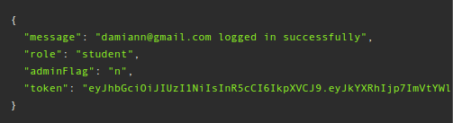

#### POST create user

API endpoint for registration in the user collection.

    POST /v1/users/create

* A successful API request will return HTTP 201 status.
Note: field 'role' and 'adminFlag' default is 'student' and 'n' when not given.

```
{
	"email": "nonyelim@gmail.com",
	"password": "nonyelim",
	"confirmPassword": "nonyelim",
	"firstName": "Nonyelim",
	"lastName": "Ndika",
	"role": "tutor"
}
```

#### Example Response
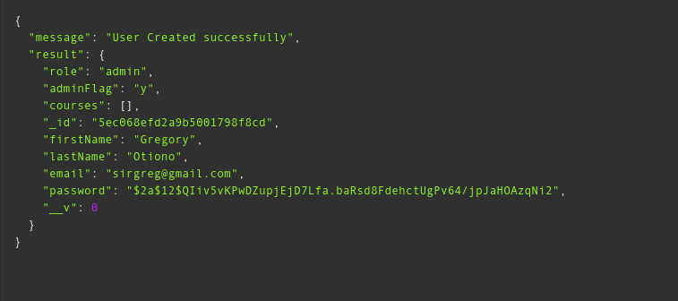

#### DELETE delete user

API endpoint to delete user in the user collection.

    DELETE /v1/users/:id (PROTECTED)

* A successful API request to delete user will return HTTP 200 status. Only an admin can delete user.

#### Example Response
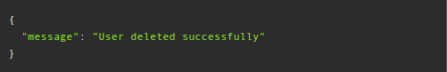

#### GET get tutor by firstname

API endpoint to get tutors by first name in the user collection.

    GET /v1/users/tutor/:firstName

* A successful API request to get tutors with their first name in an ascending order which will return HTTP 200 status.

#### Example Response
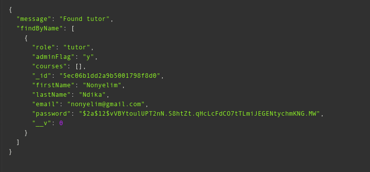

#### GET get tutor by id

API endpoint to get tutors by ID in the user collection.

    GET /v1/users/tutors/:id (PROTECTED)

* A successful API request to get tutors with ID which will return HTTP 200 status. Only an admin can make this request.

#### Example Response
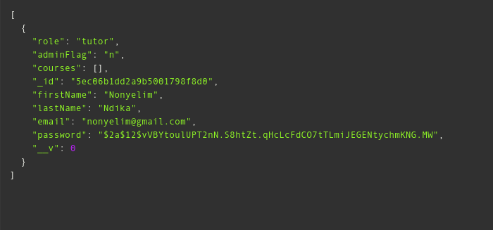

#### GET get all tutors

API endpoint to get all tutors in the user collection.

    GET /v1/users/tutors (PROTECTED)

* A successful API request to get all tutors will return HTTP 200 status. Only an admin can make this request.

#### Example Response
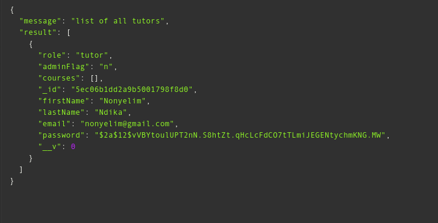

#### PUT update tutor admin flag

API endpoint to update tutor's admin flag in the user collection.

    PUT /v1/users/tutor/:id (PROTECTED)

* A successful API request will return HTTP 200 status. The essence of the endpoint is to make a tutor an admin while retaining its tutor status. Only an admin can make this request.

#### Example Response
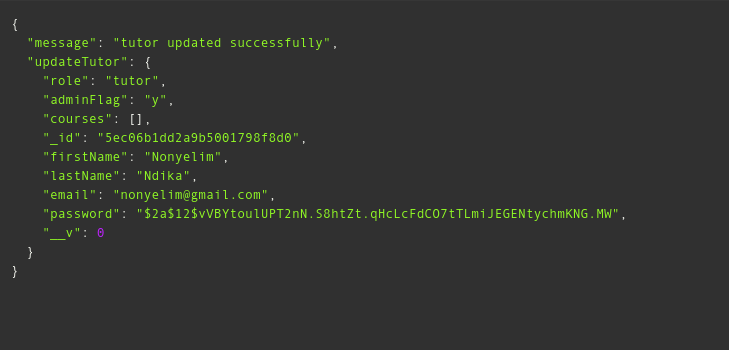