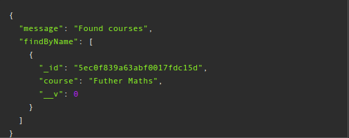
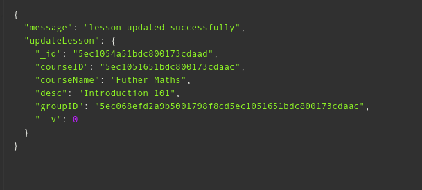

# Tutor-app API

RESTful API built with Node.js, Express.js, Mongoose, Bcrypt and JWT. It uses 'jsonwebtoken' to create the token which was used to protect routes. [API](https://tutoronlineapp.herokuapp.com/).

## Quick Start

```bash
# Install dependencies
npm install

# Serve on localhost:3000
npm run start

or   

npm run dev-start
```
```
ADMIN======>
email:sirgreg@gmail.com
password:sirgreg
```

## API Endpoints and examples

### Category Routes

#### GET get categories

API endpoint to fetch all category in the category collection.

    GET /v1/category

* A successful API request will return HTTP 200 status with a list of categories.

* Request done an empty category collection will return an empty array.

#### Example Response


#### POST create category 

API endpoint to create category in the category collection.

    POST /v1/category/create (PROTECTED)

* A successful API request will return HTTP 201 status. Only an admin can perform this request.

```
{
	"category": "nursery"
}
```

#### Example Response


#### GET get course by category

API endpoint to fetch all courses by category in the category collection.

    GET /v1/category/:id/courses

* A successful API request will return HTTP 200 status with a list of courses in a category.

#### Example Response


### Users Routes

#### GET get users

API endpoint to fetch all users in the user collection.

    GET /v1/users

* A successful API request will return HTTP 200 status with a list of users.

#### Example Response


#### POST login user

API endpoint for log in in the user collection.

    POST /v1/users/login

* A successful API request will return HTTP 200 status.

```
{
	"email": "sirgreg@gmail.com",
	"password": "sirgreg"
}
```

#### Example Response


#### POST create user

API endpoint for registration in the user collection.

    POST /v1/users/create

* A successful API request will return HTTP 201 status.
Note: field 'role' and 'adminFlag' default is 'student' and 'n' when not given.

```
{
	"email": "nonyelim@gmail.com",
	"password": "nonyelim",
	"confirmPassword": "nonyelim",
	"firstName": "Nonyelim",
	"lastName": "Ndika",
	"role": "tutor"
}
```

#### Example Response


#### DELETE delete user

API endpoint to delete user in the user collection.

    DELETE /v1/users/:id (PROTECTED)

* A successful API request to delete user will return HTTP 200 status. Only an admin can delete user.

#### Example Response


#### GET get tutor by firstname

API endpoint to get tutors by first name in the user collection.

    GET /v1/users/tutor/:firstName

* A successful API request to get tutors with their first name in an ascending order which will return HTTP 200 status.

#### Example Response


#### GET get tutor by id

API endpoint to get tutors by ID in the user collection.

    GET /v1/users/tutors/:id (PROTECTED)

* A successful API request to get tutors with ID which will return HTTP 200 status. Only an admin can make this request.

#### Example Response


#### GET get all tutors

API endpoint to get all tutors in the user collection.

    GET /v1/users/tutors (PROTECTED)

* A successful API request to get all tutors will return HTTP 200 status. Only an admin can make this request.

#### Example Response


#### PUT update tutor admin flag

API endpoint to update tutor's admin flag in the user collection.

    PUT /v1/users/tutor/:id (PROTECTED)

* A successful API request will return HTTP 200 status. The essence of the endpoint is to make a tutor an admin while retaining its tutor status. Only an admin can make this request.

#### Example Response


### Courses Routes

#### GET get courses

API endpoint to fetch all courses in the course collection.

    GET /v1/courses

* A successful API request will return HTTP 200 status with a list of courses.

#### Example Response


#### POST create course

API endpoint for course registration in the course collection.

    POST /v1/courses/create/:id (adminID) (PROTECTED)

* A successful API request will return HTTP 201 status. Only an admin can perform this request.

```
{
	"course": "Futher Maths",
	"_id": "5ebded3e1a706c4a43daff57" (categoryID)
}
```

#### Example Response


#### GET get course by name

API endpoint to get courses by name in the course collection.

    GET /v1/courses/course/:name

* A successful API request to get courses with name in an ascending order which will return HTTP 200 status.

#### Example Response


#### PUT update course

API endpoint to update course in the course collection.

    PUT /v1/courses/course/:id (PROTECTED)

* A successful API request will return HTTP 200 status. Only an admin can make this request.

```
{
	"course": "Maths"
}
```

#### Example Response


#### DELETE delete course

API endpoint to delete course in the course collection.

    DELETE /v1/courses/course/:id (PROTECTED)

* A successful API request will return HTTP 200 status. Only an admin can make this request.

#### Example Response


#### POST create lesson

API endpoint to create lesson in the lesson collection.

    POST /v1/lessons/create/:id (PROTECTED)

* where :id = tutorID from the list of tutors available.
* A successful API request will return HTTP 201 status. Only a tutor can perform this request.

```
{
	"courseID": "5ec1051651bdc800173cdaac",
	"desc": "Introduction to Futher Maths",
	"courseName": "Futher Maths"
}
```

#### Example Response


#### GET get all lessons

API endpoint to fetch all lessons in the lesson collection.

    GET /v1/lessons

* A successful API request will return HTTP 200 status with a list of courses.

#### Example Response


#### GET get a lesson

API endpoint to fetch a lesson by ID in the lesson collection.

    GET /v1/lessons/:id

* A successful API request will return HTTP 200 status.

#### Example Response


#### PUT update lesson

API endpoint to update lesson in the course collection.

    PUT /v1/lessons/lesson/:id (PROTECTED)

* A successful API request will return HTTP 200 status. Only a tutor can make this request.

```
{
	"desc": "Introduction 101"
}
```

#### Example Response


#### DELETE delete request

API endpoint to delete lesson in the lesson collection.

    DELETE /v1/lessons/:id (PROTECTED)

* A successful API request will return HTTP 200 status. Only a tutor can make this request.

#### Example Response
